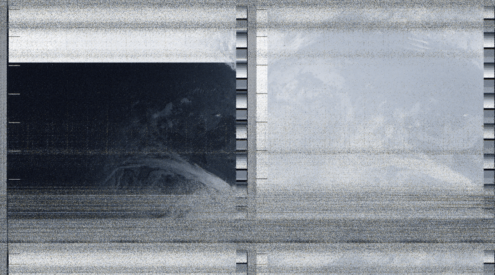
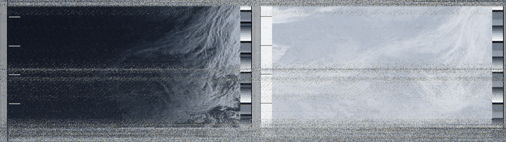

# STARS-Node

**Satellite Tracking And Receiving System** – an open-source Python utility that transforms a Raspberry Pi (or any Linux box) with an SDR (like HackRF or RTL-SDR) into an autonomous satellite data receiver. This tool is tailored for receiving NOAA APT signals, decoding them into images, and optionally colorizing them with LUT palettes. (More satellites and protocols will be added soon)

## 🚀 Introduction

STARS-Node was built with the goal of making NOAA satellite image reception as dead simple and modular as possible. The main motivation behind this project was to explore signal processing using object-oriented principles in Python while building a practical and useful tool. **STARS designed to operate in pair with the STARS-Server software**, so user can control nodes, check and process images, track satellites from the browser, while everything else is covered under the hood.

## 🧠 Problem & Requirements

**Problem Solved:**  
Automating the reception, demodulation, decoding, and visualization of APT images broadcasted by NOAA weather satellites. 
For now instead of live signal we used .wav recorded one (in pseudo-realtime mode) to make PoC of the DSP chain.

**Functional Requirements:**
- Receive baseband I/Q samples from SDR or WAV file.
- Demodulate and decode signals of satellites such as NOAA POES.
- Save grayscale and colorized satellite images.
- Send decoded data to the server via MQTT broker.
- Provide testable modular DSP components.

**Non-Functional Requirements:**
- Platform agnostic (Linux focus).
- Modular, testable code.
- Lightweight enough to run on Raspberry Pi.

## ⚙️ Design and Implementation

This project uses classic OOP principles:
- **Abstraction** via `GenericModule` and `GenericSink` base classes.
- **Encapsulation** of DSP pipeline components.
- **Inheritance** to extend generic DSP processing into specific filters, demodulators, and decoders.
- **Polymorphism** used throughout processing pipelines and sinks.
- **Builder pattern implementation** allows you to build custom DSP chains from the `dsptools` blocks
- **Factory pattern implementation** allows to create Receiver instances for different SDR's which makes the software even more flexible

### Main Components

- `dsptools/`: Modular building blocks (filters, decoders, sinks).
- `mqtt/`: module, responsible for communication with the server.
- `apt_tools/`: Legacy NOAA APT decoding logic, adapted for batch and stream decoding.
- `apt_tools/apt_colorize.py`: Applies a 2D LUT to grayscale APT images to enhance visual quality.
- `main.py`: Pipeline runner for offline WAV decoding and image generation. In the future will run complete state machine for 24/7 image capture.

## 🛠 Development Process

There are no dependencies on the libraries/frameworks for radio like GNURadio etc. 
All the math was done using common Pyhton tools.

**Languages & Tools:**
- Python 3
- NumPy, SciPy, PIL, Matplotlib
- pytest for testing
- sounddevice for audio sink support
- SDR++ for raw baseband recording

**Environment:**
- Developed on Linux (Fedora, Arch, Debian compatible)
- Possible compatibility with Windows (not tested yet)

**Steps Taken:**
1. Decoded NOAA APT from WAV manually to validate baseline.
2. Manually implemented modular DSP pipeline.
3. Created scalable, flexible architecture
4. Built reusable pipeline classes.
5. Implemented basic image processing. Integrated image colorization with LUTs.
6. Wrote unit tests for all core components.

## 📸 Features & Demo

- NOAA APT decoding (grayscale and color)
- Modular DSP chain (WAV→IQ→FM→APT)
- Headless batch processing
- Unit-tested DSP blocks
- Image colorization with 2D LUT

## 📸 Some of my recordings, decoded by this software

NOAA-15, Baltics and Scandinavia is visible (rotated)

NOAA-??, bad capture, used for testing

## ✅ Testing

All critical DSP and transformation components are covered via `pytest`-based unit tests:

- Colorizer behavior with 2D arrays and files
- WAV/byte to complex conversions
- Filter responses and demodulators
- Coordinate conversion logic

Issues like invalid input types, odd image dimensions, and filter edge cases are also covered.

## 🧾 Conclusion & Future Work

Receiving photos from a 40-year-old tin can orbiting 800 km above Earth is fun.

**Future Enhancements:**
- Add real-time streaming support for live decoding.
- Implement remote node controls via MQTT.
- Add peak detection, satellite tracking.
- Support other satellite formats (e.g., Meteor-M2, LRPT).
- Add Doppler correction in real-time mode.
- Rewrite in C++ for better perfomance.
- Add scripts for user-friendly installation.

---
